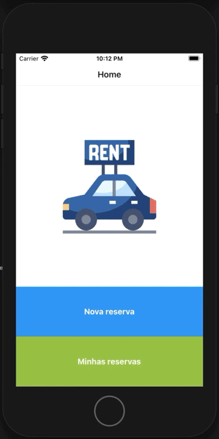
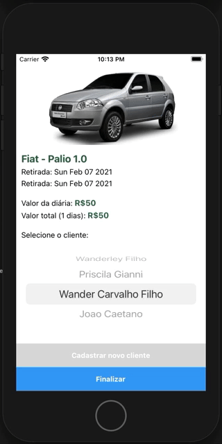
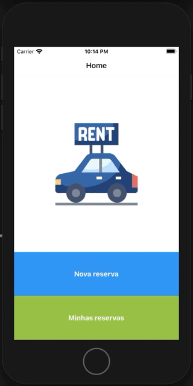

# app-reserva
App para projeto de reservas desenvolvido com React-Native 0.63, para android e iOS

## Demo

## Aspectos técinos

* Projeto desenvolvido baseado em clean architecture
* Foi utilizado jest e testing library para testes unitarios e de componentes
* Foi utilizado function components e react hooks na criação das screens e componentes
* Estrutura de componentes baseada em atomic design
* Geolocalização utilizada para capturar posição do usuário (Posteriormente utilizar reverse geocoding)
* Foi utilizado typescript para utilizar tipos e garantir assertividade na programação javascript

## Requisitos funcionais

* Tela inicial com menu
* Menu e botão na tela inicial para fazer uma nova reserva de veículo
* Ao fazer uma reserva informar o local, data/hora de retirada e data/hora de devolução
* Ao selecionar o local de retirada do carro ter a opção de localizar pelo GPS
* O App deve listar os veículos disponíveis mostrando as informações de
* Categoria, Marca, Modelo, valor da diária e foto do veículo
* O App deve permitir a seleção de um dos veículos e abrir uma tela com mais detalhes para o usuário
* confirmar o valor da tarifa e visualizar o valor total
* Ao confirmar o veículo e valor da tarifa, o App deve solicitar uma tela de cadastro do cliente com os dados:
  * CPF
  * Nome Completo
  * E-Mail
  * Celular
* O App deve validar os dados informados pelo cliente
* O App deve ter um Menu chamado “Minhas Reservas” para listar as reservas realizadas pelo usuário